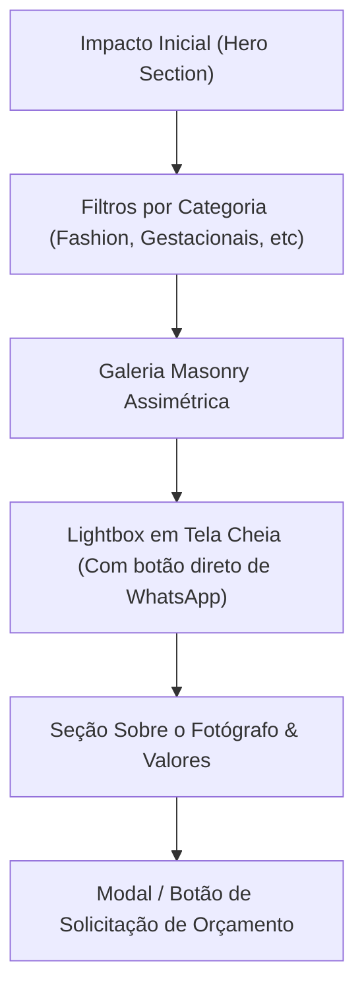

# Guia de UX, Arquitetura & Envio de Referências - João Felipe Photos

Este guia foi elaborado para estruturar a experiência do usuário (UX), definir a arquitetura de informação do novo website e preparar o template perfeito para você reunir e enviar referências visuais (da Envato, Behance, Awwwards ou Pinterest).

---

## 📍 1. Arquitetura de UX & Jornada do Visitante

### Personas-Alvo:
1. **Diretores de Arte / Produtores de Moda**: Buscam agilidade, imagens em altíssima resolução e navegação fluida por categoria (*Fashion, Editorial*).
2. **Marcas & Clientes Corporativos**: Buscam credibilidade, autoridade e facilidade de contato para campanhas/eventos.
3. **Clientes Finais (Gestantes / Retratos Autorais)**: Buscam sensibilidade visual, identificação estática e clareza no processo de orçamento.

### Fluxo da Navegação (User Journey):


---

## 🎨 2. Checklist de Referências Visuais (Para você preencher e nos enviar)

Quando você for selecionar referências no Envato / Themeforest ou na web, responda a estes 5 pontos chave:

### 1. Estilo da Capa / Hero Section
- [ ] **Opção A**: Slider em tela cheia com fotos grandes rotacionando.
- [ ] **Opção B (Atual)**: Layout split (Texto minimalista à esquerda + Card de fotos empilhadas à direita).
- [ ] **Opção C**: Vídeo em loop de fundo de um ensaio de moda/making of.

### 2. Disposição da Galeria (Grid Layout)
- [ ] **Opção A (Masonry Assimétrico)**: Fotos verticais e horizontais encaixadas naturalmente (Estilo Pinterest / Editorial).
- [ ] **Opção B (Grid Justificado)**: Linhas retas com altura fixa e larguras variáveis.
- [ ] **Opção C (Grid Rígido Quadrado)**: Blocos uniformes estilo feed do Instagram.

### 3. Estilo de Lightbox (Visualizador da Foto)
- [ ] **Opção A (Minimalista Imersivo)**: Fundo 100% escuro, foco apenas na fotografia e contador de fotos no rodapé.
- [ ] **Opção B (Editorial com Detalhes)**: Exibe a foto à esquerda e a descrição do ensaio / cliente / ano à direita.

### 4. Estética & Paleta de Cores
- [ ] **Modo Dark Obsidian (Padrão)**: Fundo `#0A0A0C` preto luxuoso, ideal para fotografia de moda e alto contraste.
- [ ] **Modo Editorial Cream / White**: Fundo claro `#FAFAFA` com tipografia refinada.
- [ ] **Dual Mode (Toggle)**: Permite ao usuário alternar entre Dark e Light com 1 clique (Já ativado no protótipo).

### 5. Links de Sites / Temas de Referência
> *Adicione abaixo os links dos temas da Envato ou portfólios que você mais gostou:*
1. **Link 1**: `https://...` *(O que mais gostou: ex: animação de hover)*
2. **Link 2**: `https://...` *(O que mais gostou: ex: layout da galeria)*
3. **Link 3**: `https://...` *(O que mais gostou: ex: página sobre mim)*

---

## 🚀 3. Guia de Deploy no GitHub & Vercel

O projeto local já está com a estrutura de pastas organizada e o **Git inicializado no branch `main`**.

### Passo 1: Criar o Repositório no GitHub
1. Acesse o seu GitHub ([github.com/new](https://github.com/new)).
2. Dê o nome ao repositório: **`joao-felipe-photos`**.
3. Deixe o repositório como **Público** ou **Privado** e **NÃO** marque as opções de adicionar README ou .gitignore (já criamos localmente).
4. Clique em **Create repository**.

### Passo 2: Conectar o Repositório Local ao GitHub
No terminal do seu computador na pasta do projeto, execute os 2 comandos fornecidos pelo GitHub:

```bash
git remote add origin https://github.com/SEU-USUARIO/joao-felipe-photos.git
git push -u origin main
```

### Passo 3: Subir na Vercel
1. Acesse **[vercel.com](https://vercel.com)** e faça login com sua conta do GitHub.
2. Clique em **"Add New..."** -> **"Project"**.
3. Selecione o repositório **`joao-felipe-photos`** da lista.
4. Framework Preset: Deixe em **"Other"** (ou Static HTML).
5. Clique em **"Deploy"**.

Pronto! A cada alteração ou código novo enviado ao GitHub (`git push`), a Vercel atualizará o site automaticamente em segundos.
